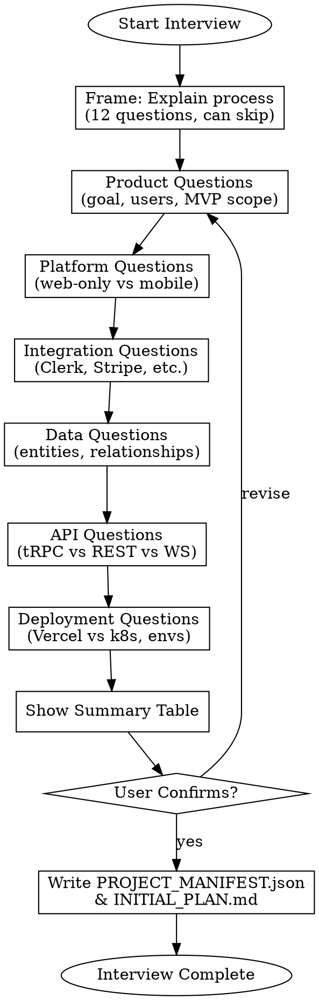
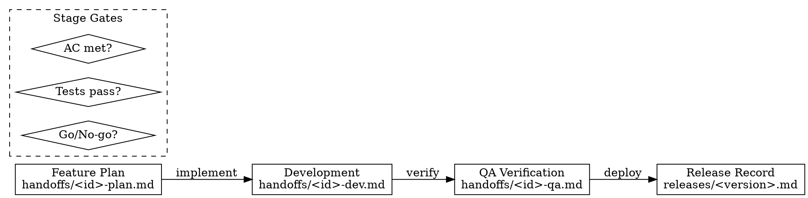

# Gmacko Ventures Skill System Design

> Architecture document for AI agent skills used across Gmacko Ventures projects.

## Overview

This document defines the skill system architecture for the vercel-neon-expo-template, which serves as the foundation for all Gmacko Ventures applications. The system enables AI agents to:

1. **Initialize new projects** through guided interviews
2. **Manage feature development** via issue tracking and backlog management
3. **Ensure quality** through QA verification workflows
4. **Automate releases** with proper staging/production gates

## Core Principles

### Artifacts Are The API

Skills communicate via durable repo artifacts, not chat state:

| Artifact | Purpose | Location |
|----------|---------|----------|
| `PROJECT_MANIFEST.json` | Machine-readable project configuration | Root |
| `INITIAL_PLAN.md` | Human-readable project plan and scope | Root |
| `docs/ai/handoffs/*.md` | Stage gate documents between roles | Per-feature |
| `docs/ai/releases/*.md` | Release records and changelogs | Per-release |

### Three-Tier Skill Hierarchy

```
Tier A: Orchestrators (composite)
    └── Coordinate multiple skills, minimal logic
    └── Example: gmacko-init-orchestrator

Tier B: Workhorse Skills
    └── Create/update artifacts, run commands, make PRs
    └── Example: gmacko-init-interview, gmacko-dev-pr-review

Tier C: Utilities
    └── Small, reusable building blocks
    └── Example: env-audit, capability-check
```

### Permission Model

| Permission | Use Case | Examples |
|------------|----------|----------|
| `allow` | Safe, local, read-only | Interview, planning, lint/typecheck |
| `ask` | External side effects | Provisioning, issue creation, deployments |
| `deny` | High-risk operations | Force push, delete repos, rotate keys |

## Skill Catalog

### Phase 1: Project Initialization

| Skill | Description | Priority |
|-------|-------------|----------|
| `gmacko-init-interview` | Guided Q&A to populate PROJECT_MANIFEST.json | High |
| `gmacko-init-plan` | Generate INITIAL_PLAN.md from manifest | High |
| `gmacko-init-bootstrap` | Execute setup.sh with validation | High |
| `gmacko-init-provision` | Wrap provision.sh with guardrails | Medium |
| `gmacko-init-validate` | Run typecheck/lint/build verification | Medium |
| `gmacko-init-orchestrator` | One-button init: interview -> plan -> bootstrap | Medium |

### Phase 2: Feature Development

| Skill | Description | Priority |
|-------|-------------|----------|
| `gmacko-dev-feature-plan` | Break features into tasks with acceptance criteria | High |
| `gmacko-dev-issue-create` | Create GitHub issues via `gh` with templates | High |
| `gmacko-dev-issue-triage` | Label/priority normalization, deduplication | Medium |
| `gmacko-dev-implement` | Execute scoped task list from plan | Medium |
| `gmacko-dev-pr-review` | Review PRs against plan and standards | Medium |
| `gmacko-dev-qa-verify` | Verify completion with test checklist | Medium |

### Phase 3: Release Management

| Skill | Description | Priority |
|-------|-------------|----------|
| `gmacko-release-prepare` | Draft release notes, verify env readiness | Medium |
| `gmacko-release-deploy-web` | Vercel deployment with smoke tests | Low |
| `gmacko-release-deploy-mobile` | EAS build/submit with validation | Low |
| `gmacko-release-close` | Close issues, annotate PRs, write record | Low |

## Workflow Patterns

### Interview Pattern (Progressive Disclosure)



### Handoff Pattern (Dev -> QA -> Release)



## Artifact Schemas

### PROJECT_MANIFEST.json

```json
{
  "$schema": "./schemas/project-manifest.schema.json",
  "version": "1.0.0",
  "project": {
    "name": "my-saas-app",
    "displayName": "My SaaS App",
    "description": "A description of the project",
    "org": "gmacko"
  },
  "platforms": {
    "web": true,
    "mobile": true,
    "mobileOnly": false
  },
  "integrations": {
    "auth": { "provider": "clerk", "enabled": true },
    "payments": { "provider": "stripe", "enabled": true },
    "analytics": { "provider": "posthog", "enabled": true },
    "monitoring": { "provider": "sentry", "enabled": true },
    "email": { "provider": "sendgrid", "enabled": false },
    "realtime": { "provider": "pusher", "enabled": false },
    "storage": { "provider": "uploadthing", "enabled": false }
  },
  "database": {
    "provider": "neon",
    "orm": "drizzle",
    "entities": ["users", "teams", "projects"]
  },
  "api": {
    "style": "trpc",
    "realtime": false
  },
  "deployment": {
    "web": {
      "provider": "vercel",
      "environments": ["development", "staging", "production"]
    },
    "mobile": {
      "provider": "eas",
      "profiles": ["development", "preview", "production"]
    }
  },
  "domains": {
    "production": "app.example.com",
    "staging": "staging.example.com"
  }
}
```

### Handoff Document Structure

```markdown
# [Feature/Issue] Handoff: [Stage]

## Context
- Issue: #123
- Plan: docs/ai/handoffs/123-plan.md
- Author: @agent-name
- Date: 2025-01-05

## Scope
[What was included/excluded]

## Acceptance Criteria
- [ ] Criterion 1
- [ ] Criterion 2

## Test Plan
[How to verify]

## Migration Notes
[Database/breaking changes]

## Known Issues
[Any caveats]

## Recommendation
[Go/No-go with reasoning]
```

## Red Flags (Common AI Failure Modes)

| Rationalization | Correction |
|-----------------|------------|
| "I'll skip typecheck, it's a small change" | ALL changes require `pnpm typecheck && pnpm lint` |
| "Let me just commit the .env file" | NEVER commit secrets; use `.env.local` only |
| "I'll skip the interview, user seems clear" | ALWAYS complete the manifest before generating plan |
| "Tests can be added later" | Include test plan in every handoff document |
| "I'll push directly to main" | ALL changes go through PR with review |

## Integration with Existing Scripts

Skills WRAP existing scripts rather than replace them:

```
┌─────────────────────────────────────────────────────────┐
│ gmacko-init-bootstrap                                   │
├─────────────────────────────────────────────────────────┤
│ 1. Preflight checks (git clean, tools installed)        │
│ 2. Read PROJECT_MANIFEST.json for app name              │
│ 3. Execute: ./scripts/setup.sh <app-name> [--no-mobile] │
│ 4. Post-validate: pnpm typecheck && pnpm lint           │
│ 5. Write: docs/ai/handoffs/init-bootstrap.md            │
└─────────────────────────────────────────────────────────┘
```

## Versioning Strategy

- Skills version alongside the template
- `TEMPLATE_VERSION` in `package.json`
- `docs/ai/CHANGELOG.md` tracks skill changes
- Compatibility field in skill metadata validates version match

## Directory Structure

```
.opencode/
└── skill/
    ├── gmacko-init-interview/
    │   └── SKILL.md
    ├── gmacko-init-plan/
    │   └── SKILL.md
    ├── gmacko-init-bootstrap/
    │   └── SKILL.md
    ├── gmacko-init-orchestrator/
    │   └── SKILL.md
    ├── gmacko-dev-feature-plan/
    │   └── SKILL.md
    ├── gmacko-dev-issue-create/
    │   └── SKILL.md
    └── gmacko-dev-pr-review/
        └── SKILL.md

docs/ai/
├── README.md
├── CHANGELOG.md
├── skills-catalog.md
├── handoffs/
│   └── .gitkeep
├── checklists/
│   ├── qa-checklist.md
│   ├── release-checklist.md
│   └── security-checklist.md
├── examples/
│   ├── INITIAL_PLAN.example.md
│   └── PROJECT_MANIFEST.example.json
└── releases/
    └── .gitkeep
```

## Next Steps

1. Implement Phase 1 skills (init-interview, init-plan, init-bootstrap)
2. Create PROJECT_MANIFEST.json schema
3. Create INITIAL_PLAN.md template
4. Add GitHub issue templates
5. Test end-to-end flow with sample project
